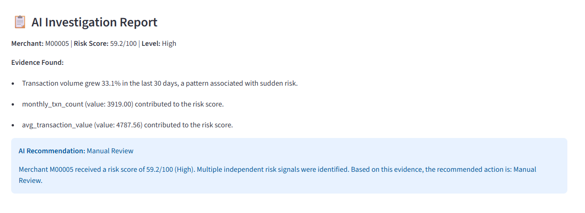
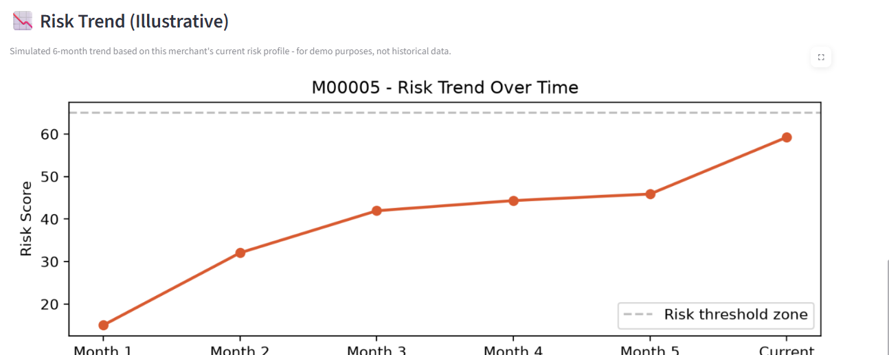
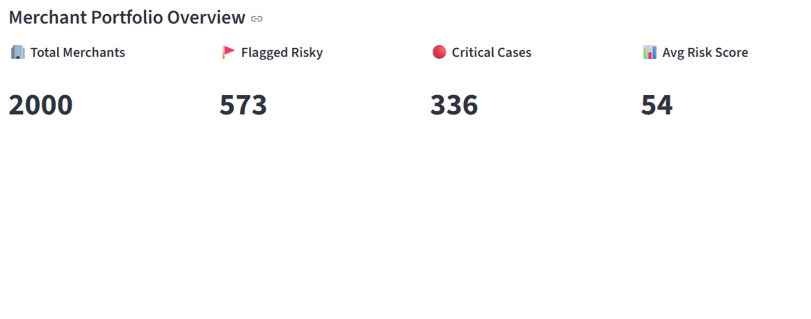

\# 🛡️ MerchantGuard AI
   


\*\*Explainable AI-powered merchant risk scoring and decision support system\*\* — built for Razorpay's AI Buildathon 2026 (AI Risk Manager track).


🔗 \*\*Live Demo:\*\* https://merchantguard-ai-dzdzbaghveokmqdi5ytwop.streamlit.app/


## Screenshots

**Overview Dashboard**


**Explain Merchant with AI Investigation**


**Business Impact Simulator**


\## Data Disclaimer

This prototype uses synthetically generated merchant data because real merchant payment and risk data is sensitive and unavailable publicly. Model metrics demonstrate performance on the simulated dataset and should not be interpreted as production performance. With real historical data, this approach would require additional validation, calibration, and drift monitoring before deployment.


!\[Architecture](architecture\_diagram.png)


\## The Problem

Payment platforms like Razorpay onboard thousands of merchants. Some pose risk — high refund rates, sudden volume spikes, chargeback patterns — that can lead to fraud, defaults, or financial loss. Manually reviewing every merchant doesn't scale, and a black-box risk score isn't useful to an analyst who has to justify decisions.


\## The Solution

MerchantGuard AI scores every merchant's risk (0-100), explains why each score was given, converts that score into a recommended action, and lets an analyst check any new merchant in real time — all backed by explainable AI, not a black box.


\## How It Works

1\. \*\*Data\*\* — Merchant transaction data (volume, refund rate, chargeback rate, account age, category, growth patterns)

2\. \*\*Model\*\* — XGBoost classifier trained to predict risk (ROC-AUC: 0.95), benchmarked against Random Forest using 5-fold cross-validation

3\. \*\*Explainability\*\* — SHAP values break down exactly which factors drove each merchant's score, shown both technically and in plain English

4\. \*\*Decision Engine\*\* — Converts raw risk scores into clear recommended actions (Approve / Monitor / Manual Review / Enhanced Investigation), with business-rule escalation for extreme chargeback patterns

5\. \*\*Live Risk Check\*\* — Enter any new merchant's details and get an instant score, explanation, and recommended action — not limited to pre-loaded data

6\. \*\*Business Impact Dashboard\*\* — Interactive threshold slider showing the real trade-off between catching risk and generating false alarms, tied to estimated business cost


\## Tech Stack

Python, XGBoost, SHAP, Streamlit, Pandas, Scikit-learn


\## Results

\- \*\*0.95 ROC-AUC\*\* on held-out test data

\- \*\*82% recall\*\* on risky merchants

\- Fully explainable - every prediction traceable to specific behavioral signals

\- \*\*False-positive cost:\*\* Every wrongly-flagged safe merchant means delayed payouts and manual review overhead - the model is tuned to balance catching real risk against this business cost, not maximize accuracy alone.

\- \*\*Cost-optimized threshold:\*\* Instead of a default 0.5 cutoff, the decision threshold was optimized against estimated business cost (Rs.50,000 per missed risky merchant vs Rs.2,000 per false alarm) - reducing total estimated cost by \*\*62.8%\*\* (Rs.10.98L to Rs.4.08L on the test set).


!\[Threshold Cost Curve](threshold\_cost\_curve.png)


\## Edge Case Testing

The model was stress-tested against deliberately unusual merchant profiles:

\- Correctly flagged a brand-new account with a suspicious volume spike (0.82 risk)

\- Correctly flagged a long-trusted merchant with one genuinely bad month (0.95 risk)

\- Correctly passed a "high-risk category" (Crypto/Trading) merchant with clean behavior - confirming the model judges actual behavior, not category stereotypes

\- \*\*Known limitation:\*\* Dormant, zero-activity merchants score as low-risk. In production, this would need a separate "sleeper account" monitoring layer, since fraud rings sometimes hold accounts inactive before use.


\## Scope

MerchantGuard AI is strictly a \*\*defensive risk-scoring tool\*\*. It flags merchant behavior for human review - it does not take autonomous action, block transactions, or make final decisions. All outputs are advisory signals for a risk analyst.


\## Run It Locally

```bash

pip install pandas numpy scikit-learn xgboost shap streamlit matplotlib

streamlit run app.py

```


\## Author

Built solo by Rupesh for Razorpay AI Buildathon 2026.

