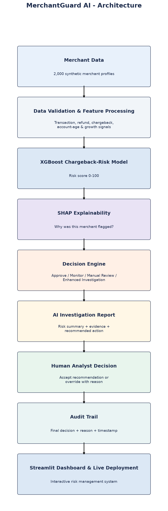
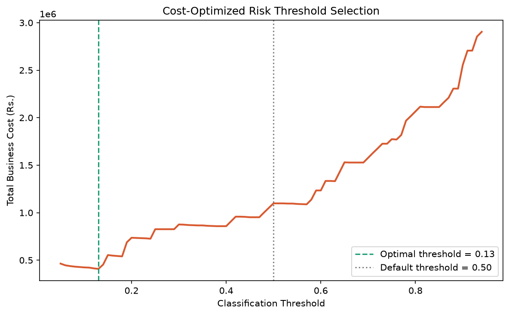

# 🛡️ MerchantGuard AI
   

**Explainable AI for Early Detection of Chargeback-Driven Merchant Financial Risk** — built for Razorpay's AI Buildathon 2026 (AI Risk Manager track).

🔗 **Live Demo:** https://merchantguard-ai-dzdzbaghveokmqdi5ytwop.streamlit.app/

## Screenshots

**Overview Dashboard**


**Explain Merchant with AI Investigation**


**Business Impact Simulator**


## Data Disclaimer

This prototype uses synthetically generated merchant data because real merchant payment and risk data is sensitive and unavailable publicly. Model metrics demonstrate performance on the simulated dataset and should not be interpreted as production performance. With real historical data, this approach would require additional validation, calibration, and drift monitoring before deployment.



## The Problem

Payment platforms can face significant financial loss when merchant chargeback behavior increases unexpectedly. MerchantGuard AI detects merchants showing early behavioral signals associated with elevated chargeback risk, helping risk analysts investigate cases before losses escalate.

## The Solution

MerchantGuard AI is an explainable AI-powered early warning system for chargeback-driven merchant risk. It analyzes merchant behavior, predicts risk on a 0-100 scale, explains the key contributing signals using SHAP, recommends an action, and keeps the final decision with a human analyst.

## 🎯 Target Loss

MerchantGuard AI focuses on **chargeback-driven merchant financial loss**. Refund behavior, transaction growth, customer complaints, account age, and other behavioral signals are used as early indicators to predict elevated chargeback-related risk.

## How It Works

1. **Data** — Merchant transaction data (volume, refund rate, chargeback rate, account age, category, growth patterns) — all used as early indicators of chargeback-driven risk
2. **Model** — XGBoost classifier trained to predict risk (ROC-AUC: 0.95), benchmarked against Random Forest using 5-fold cross-validation
3. **Explainability** — SHAP values break down exactly which factors drove each merchant's score, shown both technically and in plain English
4. **Decision Engine** — Converts raw risk scores into clear recommended actions (Approve / Monitor / Manual Review / Enhanced Investigation), with business-rule escalation for extreme chargeback patterns
5. **Live Risk Check** — Enter any new merchant's details and get an instant score, explanation, and recommended action — not limited to pre-loaded data
6. **Business Impact Dashboard** — Interactive threshold slider showing the real trade-off between catching risk and generating false alarms, tied to estimated business cost
7. **AI Investigation Report** — Converts the model's feature-level evidence into an analyst-friendly investigation summary
8. **Human-in-the-Loop Decision** — Analysts can approve the AI recommendation or override it with a documented reason
9. **Audit Trail** — Analyst decisions, overrides, reasons, and timestamps are recorded for traceability
10. **Dormancy Detection** — A rule-based check flags established accounts with unusually low recent activity, a "sleeper account" pattern the ML model isn't trained to catch
11. **Risk Trend** — An illustrative trend visualization demonstrates how behavioral deterioration could be monitored over time; clearly labeled as simulated in this prototype

## Tech Stack

Python, XGBoost, SHAP, Streamlit, Pandas, Scikit-learn

## Held-Out Test Performance

Evaluated on a stratified 80/20 train/test split of the synthetic dataset (400 test merchants, unseen during training):

| Metric | Not Risky | Risky |
|---|---|---|
| Precision | 0.93 | 0.80 |
| Recall | 0.92 | 0.82 |
| F1-score | 0.92 | 0.81 |

- **ROC-AUC:** 0.949
- **Overall accuracy:** 89%
- **Evaluation:** Held-out test set, unseen during training
- **False positive rate:** 8.4% (24 of 285 legitimate merchants wrongly flagged)
- **False negative rate:** 18.3% (21 of 115 risky merchants missed)

**Honest take:** The model favors precision over full recall — it misses about 1 in 5 risky merchants rather than over-flagging legitimate ones. In a production system, this threshold would be tuned based on the real cost of a false positive (blocking a good merchant) vs. a false negative (letting fraud through).

## Results

- **0.95 ROC-AUC** on held-out test data
- **80% precision / 82% recall** on risky merchants
- Fully explainable - every prediction traceable to specific behavioral signals
- **False-positive cost:** Every wrongly-flagged safe merchant means delayed payouts and manual review overhead - the model is tuned to balance catching real risk against this business cost, not maximize accuracy alone.
- **Cost-optimized threshold:** Instead of a default 0.5 cutoff, the decision threshold was optimized against estimated business cost (Rs.50,000 per missed risky merchant vs Rs.2,000 per false alarm) - reducing total estimated cost by **62.8%** (Rs.10.98L to Rs.4.08L on the test set).



## Edge Case Testing

The model was stress-tested against deliberately unusual merchant profiles:

- Correctly flagged a brand-new account with a suspicious volume spike (0.82 risk)
- Correctly flagged a long-trusted merchant with one genuinely bad month (0.95 risk)
- Correctly passed a "high-risk category" (Crypto/Trading) merchant with clean behavior - confirming the model judges actual behavior, not category stereotypes
- **Known limitation (addressed):** The core ML model, trained on behavioral risk, initially scored dormant zero-activity merchants as low-risk. This was closed with a separate rule-based dormancy detector that flags established accounts with unusually low recent activity — a "sleeper account" pattern fraud rings sometimes exploit, and one the main model was never designed to catch.

## Scope

MerchantGuard AI is strictly a **defensive risk-scoring tool**. It flags merchant behavior for human review - it does not take autonomous action, block transactions, or make final decisions. All outputs are advisory signals for a risk analyst.

## Run It Locally

```bash
pip install pandas numpy scikit-learn xgboost shap streamlit matplotlib
streamlit run app.py
```

## Author

Built solo by Rupesh for Razorpay AI Buildathon 2026.